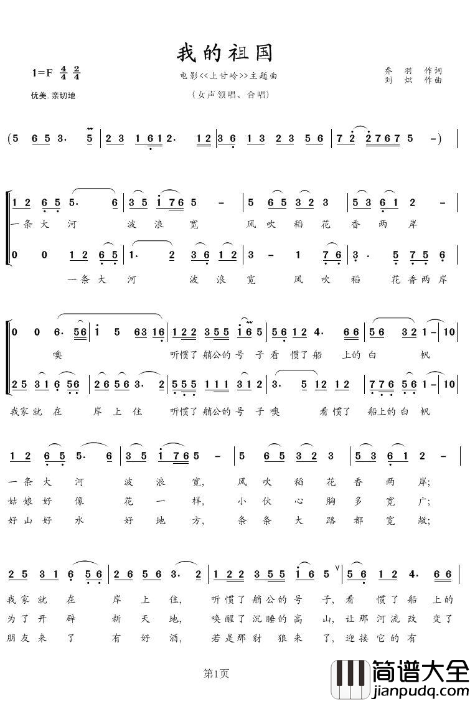
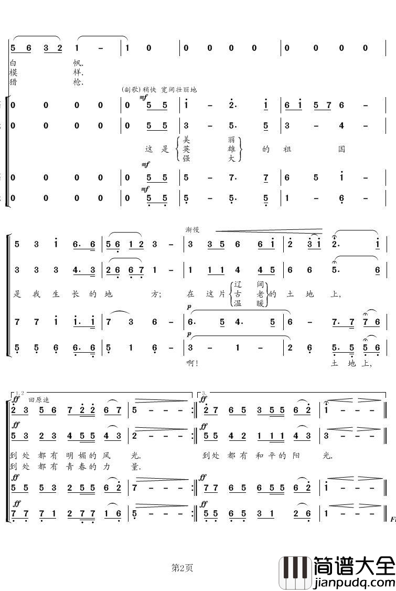

# 《我的祖国》· 歌曲调研文档

> **调研日期**：2026-09-26
> **调研对象**：歌曲《我的祖国》（首句「一条大河波浪宽」），常简称《一条大河》。
> **用途**：为 GMI Cloud「Hy Image Challenge」作品创作提供史实、乐谱、背景与意境参考。
> **事实分级**：【事实】=多源交叉；【出处】=单一来源；【推断】=基于事实的合理推导。

---

## 1. 基本信息一览

| 项目 | 内容 | 依据 |
|---|---|---|
| 曲名 | 《我的祖国》 | 【事实】 |
| 俗称 | 《一条大河》《一条大河波浪宽》 | 【事实】 |
| 出处 | 1956 年战争电影《上甘岭》主题插曲 | 【事实】 |
| 作词 | 乔羽（时年 29 岁） | 【事实】 |
| 作曲 | 刘炽 | 【事实】 |
| 原唱 | 郭兰英（女高音） | 【事实】 |
| 发行 | 1956-12-01，随《上甘岭》公映 | 【事实】 |
| 时长 | 原版 5:33；部分版本约 3:40 | 【出处】 |
| 调式 | F 大调（乐谱标 1=F） | 【事实】 |
| 拍号 | 4/4 拍 | 【事实】 |
| 情绪标记 | 「优美、亲切地」；副歌「稍快、宽阔壮阔地」 | 【事实·乐谱】 |
| 曲式 | 二段式：主歌（女高音领唱）＋副歌（合唱），歌词三段 | 【事实】 |
| 奖项 | 1986 中国白金唱片；1989 第一届中国金唱片奖（创作特别奖、作曲奖、演唱奖） | 【事实】 |

---

## 2. 创作背景

### 2.1 导演的邀约与立意
《上甘岭》导演沙蒙对乔羽只说了一句：
> 你想怎么写就怎么写，我只希望将来这部片子没人看了，这首歌还有人唱。【事实】

### 2.2 刻意选择抒情
- 影片本身是战斗片，乔羽刻意不走「火药味」的歌曲写法，避免与画面「同色同调」。
- 他想表现的是战士在严酷战争中那份**镇定、乐观、从容、心胸辽阔**，是战争之后的宁静与开阔。【出处】

### 2.3 「一条大河」的来历
- 乔羽当时赴江西采风，横渡长江，被两岸葱绿所震慑。
- 由此得出首句「一条大河波浪宽」。沙蒙问他为何不用「万里长江」他答：**每个人家门口都有一条河，用「长江」会让非江边的人有距离感，而这条河就是每个人的祖国**。【事实】
- 20 多天后，凭「有了第一句就等于全篇」完成全词。【出处】

### 2.4 旋律的民间性
- 刘炽拿到歌词后把自己关起来数日，反复朗读、吹奏竹笛、寻找民间曲调，从陕北《小放牛》等民歌中寻找灵感。
- 歌的整体气质结合了「颂歌」与「进行」两种体裁，有《歌唱祖国》(1950) 一脉的影响【出处】【推断】。
- 音乐评论（维基）：主歌「委婉、一唱三叹」，有北方民歌风格；副歌「气势磅礴」将其升华【出处】。
（另一源提到"江南小调"成分，两处表述不完全一致，可归为"带民歌曲风之抒情旋律"。）

### 2.5 原唱人选
- 试唱多位后，推荐了郭兰英。
- 郭兰英把它唱作「山西老家黄河意义上」的河——「祖国所有河流都集中在歌里」。
- 一唱即定；录音次日便在中央人民广播电台播出，早于电影公映，起先声夺人之功。【事实】

---

## 3. 歌词结构与重要语句

> **版权与可编辑性说明**：完整歌词为受版权保护的原创作品。本文档不逐字存写全部歌词，只给出结构与少量已证实的片段，剩余请参照权威歌词页（如维基·中文歌词）或你提供的原始文本核对。
> 你的原始文本把第一段（大河／稻花…）重复了一次，属录音版本普遍差异，实际结构为「三段主歌＋三段副歌」。

### 3.1 结构骨架
- 每段 = 主歌（女高音领唱）＋ 副歌（合唱）
- 副歌反复主题词：**「这是美丽的祖国」→「这是英雄的祖国」→「这是强大的祖国」，在我那生长的地方**。
- 三段分别对应关键词：**美丽（风光）、英雄（高山／力量）、强大（阳光）**，由风景到人、由家到国、由柔到极到和平。【事实】【推断】

### 3.2 已确认的关键片段
- 见首：**「一条大河波浪宽，风吹稻花香两岸」**，其后「我家就在岸上住，听惯了艄公的号声，看惯了船上的白帆」。
- 中段名言：**「姑娘好像花儿一样，小伙儿心胸多宽广」」「唤醒了沉睡的青山」**。
- 转折名句：**「朋友来了有好酒，若是那豺狼来了，迎接它的有猎枪」**。
- 收束：**「在这片温暖的田地上，到处是和平的阳光」**。
> 以上均经 OCR 对乐谱所读到的歌词为准【事实·乐谱】；全文以权威歌词页为准。

---

## 4. 乐谱与音乐分析

### 4.1 乐谱文件（随文交付）
- 简谱两页：`乐谱-简谱-第1页.png`（主歌）／`乐谱-简谱-第2页.png`（副歌）
- 合订 PDF：`乐谱-简谱-我的祖国.pdf`

> 版本：网络简谱（简谱大全）载「女声领唱、合唱」版，F 调 4/4。网络谱为教学流传版，正式以出版物为准，商用需另行授权。

### 4.2 曲式
- 调性 F 大调；4/4 拍
- 二部曲式，主歌（领唱）→ 副歌（转快、宽阔）
- 主歌短促绵密、民歌腔；副歌以「祖国、生长、地方」等长音收口，将情绪抬高至壮阔
- 谱面大谱骨干音＋词下小字注音，适于齐唱 / 合唱【事实·乐谱】

### 4.3 为什么听起来「广大」
【推断】来源：4/4 有「过拍」从容；主歌以长音、附点句收放；大量叠渲染（波浪、两岸、白帆、辽阔）；副歌以「光」等元音长音高音荡开，形成辽远感。

---

## 5. 战场背景：从抗美援朝到《上甘岭》

### 5.1 上甘岭战役（1952）【事实】
- 1952 年 10 月起，抗美援朝僵持期最激烈一役。
- 上甘岭（北朝鲜金化郡）不足 4 平方公里的阵地，遭敌炮弹 190 万发、炸弹 5000 余。
- 中方凭完防御在装备劣势下坚守，迫对方停止攻势，扭转此军之败。
- 彭德怀有名言：「西方侵略者在东边海岸架几尊炮就可以在这种……时代已一去不返——一个觉醒的民族不可战胜。」【事实】

### 5.2 电影与卫生员「王兰」
- 电影《上甘岭》主线写志愿军坑道作战乐观与英勇。
- 名场面：坑道缺水缺粮，女卫生员**王兰**为伤员演唱《我的祖国》，把残酷战争与美好歌声对位，成为作品经典。
- 原型：志愿军 15 军45 师卫生员**王清珍**（15 岁入朝），与战友**吴炯**等·众皆为「王兰」原型【事实】。

---

## 6. 文化影响

- 极高传唱度，被誉为中国人心目中「最美之歌之最」（郎朗语）【事实】。
- 抗美援朝时代最具代表性文艺作品之一；伴随历届国庆、纪念活动广泛传唱。
- 翻唱：李谷一、彭丽媛、张也、宋祖英、汪明荃、周深、刀郎等；器乐：郎朗钢琴、BBC 威尔士国家乐团（2012）、多版管弦。
- 影像：嫦娥一号（2007）搭载；电影《我和我的家乡》（2020）片尾；《跨过鸭绿江》（2020）片尾。
- 2016「龙应台讲座」：全场齐唱成事件；后《大河就是大河》与《解放军报·大河不只是大河》之争，说明"大河"存有军事与国土的情感承载。【事实】

**外交/展会场景**：2011 郎朗在白宫国宴演奏《我的祖国》，曾引发多国媒体外交解读。【出处】

---

## 七、歌词艺术评价
- 起笔白描（河、花、船、号、帆），不喊口号却有亲切。
- 「我家乡门口那—条河＝祖国」——把大的落在小的，戳中普通人。
- 情绪段：由景（大河）→人（姑娘小桥）→建（开天地）→决战「朋友来不动友，豺狼来有猎枪」→归于「和平阳光」；家到国、由柔到刚。
- 副歌主谓语的结构反复，把三段用同目标式托住，便于合唱记忆。【推断】

---

## 8. 版权与使用注意
- 乐谱为民间流传谱，版权归原社；歌词版权归词曲作者与出版方。
- 本文档与曲谱仅供个人学习、创作参考，不做商业公开使用。
- 使用者用作参赛（陈列 LA/SF 或宣传物），请先按原词、原谱取得相应授权；并遵守主办方原创声明与 GMI Acceptable Use Policy。

---

## 9. 对本参赛的启示（附参考）
- 三段「美丽／英雄／强大」＝一套作品的天然结构，与 Hy Creative「one set」形式相契合。
- 大河、白帆、青山、稻花、阳光——意象画面感强，适合抒情润、写意类设计。
- 牢记实测的「长文字退化」：本文歌词较长，务必「化整为零」，不要全部一次排入画。

---

## 10. 参考来源（节选）
- 维基百科《我的祖国（电影插曲）》：https://zh.wikipedia.org/wiki/我的祖国_(中国)
- 新华网《中国心中永远流淌 “一条大河”》新闻
- 家政部《上甘岭卫生员·王兰原型王清珍》
- 人教版初音乐曲谱资料；jianpujian（曲谱来源）

> **文档结束**