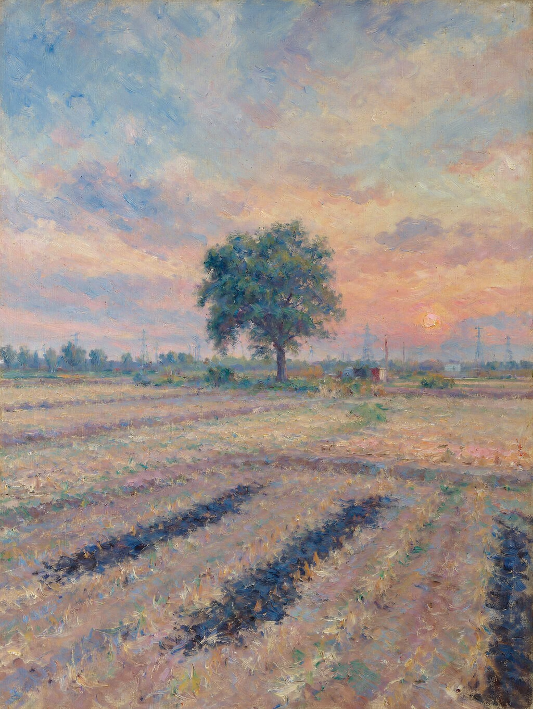
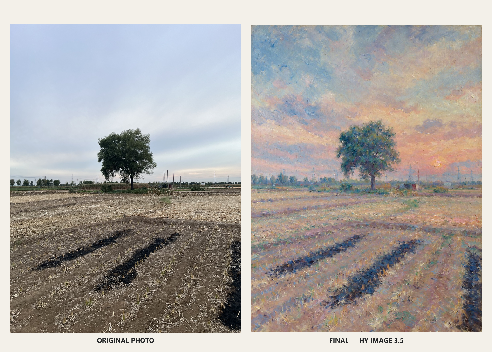
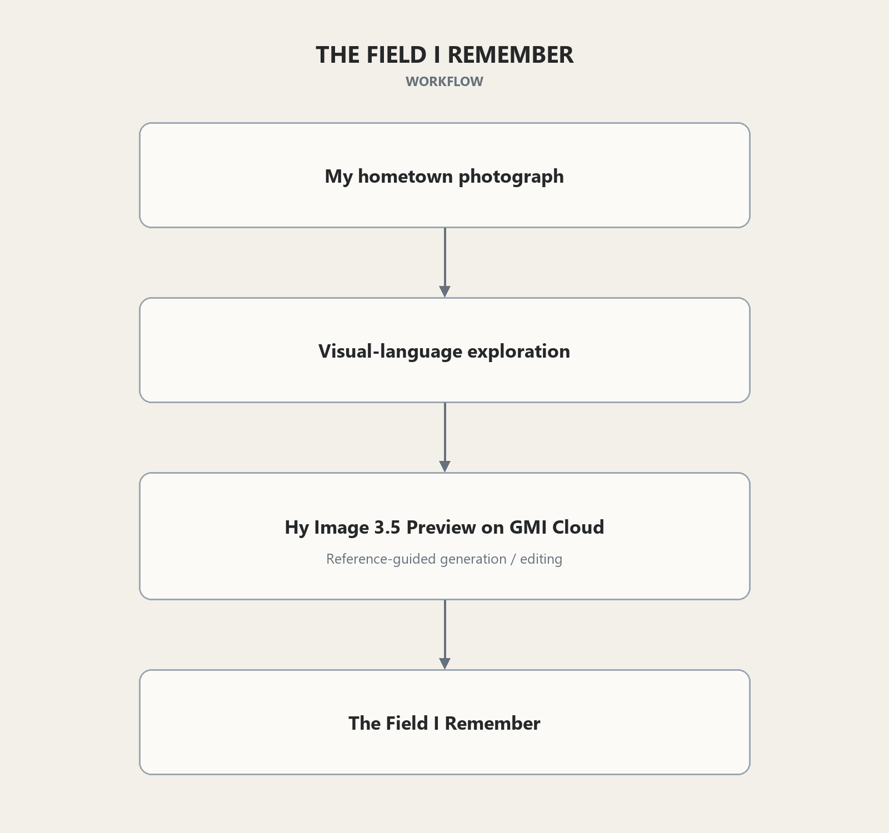

# The Field I Remember

**Hy Image Challenge — Track 2: Commercial**

An ordinary harvested field on the North China Plain, translated into an Impressionist memory without erasing the details that make it home.

> AI did not invent a prettier hometown; it helped me see a known place differently.

## Submission at a glance

| | |
|---|---|
| Final model | `hy-image-v3.5-preview` |
| Generation service | GMI Cloud |
| Method | Reference-guided generation / editing |
| Final size | 1024 × 1360 PNG |
| Post-processing | None |
| Campaign window | September 25–October 1, 2026 |

The work begins with a photograph I took of my hometown. It preserves the central lone tree, harvested farmland, utility poles and transmission towers, village horizon, and dark traces of burned corn stalks. Broken color, softened edges, and atmospheric light turn those ordinary details into a memory while keeping the place recognizable.

The visual language is Impressionist, but the work is not a replica of a Claude Monet painting. A public-domain museum image of Monet's *The Houses of Parliament, Sunset* was used only as a style reference; the place, viewpoint, and subject come from the entrant's own photograph and visual exploration.

## Source to final

## Workflow

Early text-only, reference-guided, and style-transfer studies helped establish the visual language. Supporting AI tools assisted with exploration and workflow organization. The final image itself was generated with Hy Image 3.5 Preview through GMI Cloud, using an intermediate composition reference and the public-domain Monet image as a separate style-only reference.

## Integrity and provenance

- Final request ID: `fd219d7d-bfa7-401a-8633-7342106ae10e`
- Final SHA-256: `2574488dcc7873cd5eac764880b54c289d9c906547eddbd209bc340e26a376b1`
- The selected model output was copied byte-for-byte to `final.png`.
- No retouching, repainting, upscaling, color adjustment, or cropping was applied to the final artwork.
- The generation completed during the official campaign window.

## Review files

- [`final.png`](./final.png) — submitted artwork
- [`source-photo.jpg`](./source-photo.jpg) — entrant's original hometown photograph
- [`before-after.png`](./before-after.png) — source/final comparison
- [`workflow.png`](./workflow.png) — workflow overview
- [`WORKFLOW.md`](./WORKFLOW.md) — complete process description
- [`FINAL_PROMPT.txt`](./FINAL_PROMPT.txt) — exact final prompt
- [`PROVENANCE.md`](./PROVENANCE.md) — request and file-integrity record
- [`RULES_CHECK.md`](./RULES_CHECK.md) — official-rule checklist
